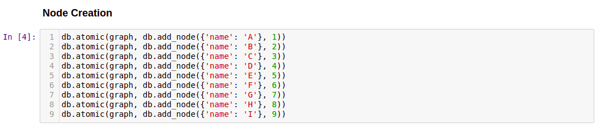
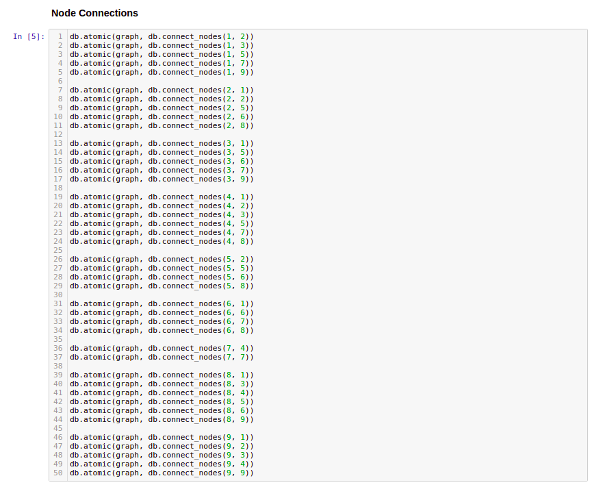
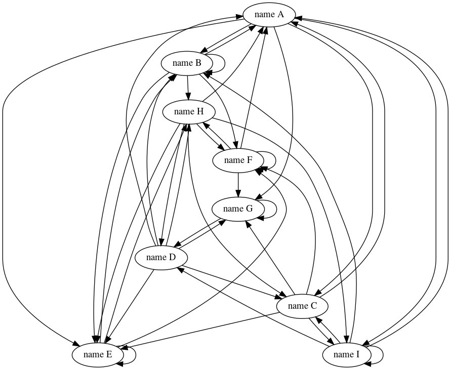
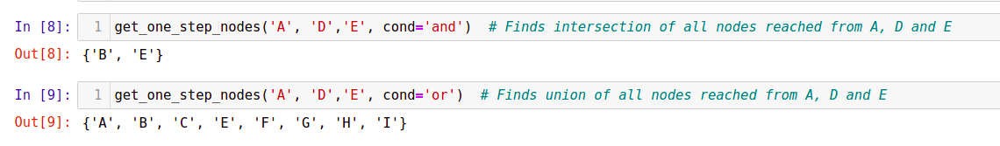
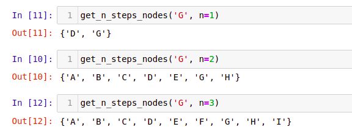

# Sqlite3_QueryGraph

### Task:
Given an image create a Directed Graph and Query it in a graph database.

On this try to query for :

A. All vertices you can reach in one step from A, D, E

B. All vertices you can reach in two steps from I

### Dependencies:
* SQLite3
* Python3.7
* Graphviz

### Installation

* [SQLite](https://www.sqlite.org/), version 3.31.0 or higher; get the latest source or precompiled binaries from the [SQLite Download Page](https://www.sqlite.org/download.html) 
* [Python](https://www.python.org/)
* [Graphviz](https://graphviz.org/) for visualization
  -  install ([download page](https://www.graphviz.org/download/), [installation procedure for Windows](https://forum.graphviz.org/t/new-simplified-installation-procedure-on-windows/224)); and
  - `pip install graphviz`

### Basic Functions

The [database script](python/database.py) provides convenience functions for [atomic transactions](https://en.wikipedia.org/wiki/Atomicity_(database_systems)) to add, delete, connect, and search for nodes.

Any single node or path of nodes can also be depicted graphically by using the `visualize` function within the database script to generate [dot](https://graphviz.org/doc/info/lang.html) files, which in turn can be converted to images with Graphviz.

### Approach:

This is the [Python](https://www.python.org/) implementation.

1. Created a database object and initialized it by method initialize defined in database.py

2. Created all the nodes given in an image.png i.e. A, B, C, D, E, F, G, H, I.

3. Connect all the created node as per the image.png

4. After connections, graph looks like this

5. Created a function named as 'get_one_step_nodes' which uses 'get_connections_one_way' method from database.py to find all the connections of single node.
   'get_one_step_nodes' takes any number of nodes as an argument and results one step connections from all the given nodes

6. Created a function named as 'get_n_step_nodes' which uses 'get_one_step_nodes' method to find all the connections of single node recursively.
   'get_n_step_nodes' takes two arguments 'a node' and 'number of steps to reach'

For full solution refer to python/Graph.ipynb

